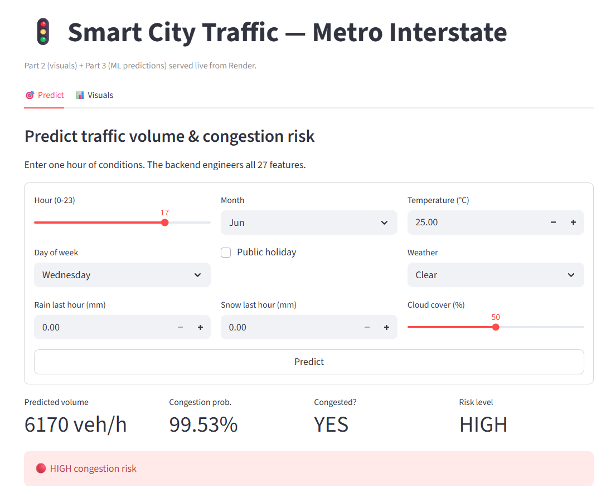

# Capstone SK Traffic — Deploy

**Live demo:** https://aievershine.com/traffic

**Architecture:** Cloudflare Edge → Tunnel (Acer) → Streamlit :8501 → FastAPI :8000

**Status:** Migrated off Render free tier on 2026-09-29. Tunnel runs as Windows service `Cloudflared

> Free tier cold-starts in ~30-50s after 15 min idle. First request may be slow.

## Screenshot



Public deployment of the **Metro Interstate Traffic Volume** capstone
(2012-2018, 40,575 cleaned rows).

- **Backend** - FastAPI serving `GET /health` and `POST /predict`
- **Frontend** - Streamlit dashboard (Predict tab + Visuals tab)
- **Hosting** - both on Render free tier, deployed from this repo

> Original grading repo (Part 1/2/3 evidence, notebooks, reports):
> https://github.com/StanleyNeo/capstone-project-sk-traffic

## Repo layout

```
backend/
  app/main.py            FastAPI app (predict, health, feature engineering)
  models/*.joblib        compressed models (62 MB total)
  requirements.txt
frontend/
  app.py                 Streamlit UI
  figures/*.png          4 Part 2 exploratory charts
  requirements.txt
render.yaml              Render Blueprint (both services)
```

## Models

- `traffic_regressor.joblib` - RandomForestRegressor, MAE 241.2, R2 0.9575
- `congestion_classifier.joblib` - RandomForestClassifier, AUC 0.9828

Saved with `joblib.dump(..., compress=3)` to keep each under GitHub's 100 MB limit.

## Local run

```powershell
# T1 - backend
cd backend
uvicorn app.main:app --host 127.0.0.1 --port 8000

# T2 - frontend (needs BACKEND_URL, defaults to 127.0.0.1:8000)
cd frontend
$env:BACKEND_URL="http://127.0.0.1:8000"
streamlit run app.py --server.port 8501
```

## Deploy on Render

1. Push this repo to GitHub (public).
2. Render dashboard -> New -> Blueprint -> select this repo -> Apply.
3. After the backend goes live, copy its URL and set `BACKEND_URL`
   on the `traffic-streamlit` service (Environment tab).
4. Redeploy the frontend service.

## API contract

```jsonc
POST /predict
{
  "hour": 17, "day_of_week": 2, "month": 6,
  "temp_c": 25.0, "rain_1h": 0.0, "snow_1h": 0.0,
  "clouds_all": 50.0, "weather_main": "Clear", "is_holiday": false
}
// -> { "predicted_traffic_volume": 6405.6,
//      "congestion_probability": 1.0,
//      "congestion_predicted": true,
//      "risk_level": "HIGH" }
```


